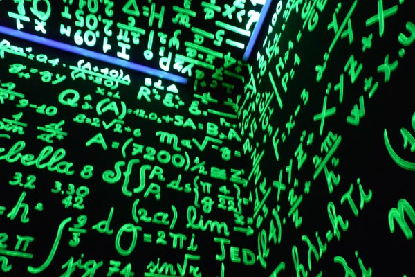

# Apprendre à coder 🌐

## Commencer à coder ?

=== "Je veux apprendre"
    {==

    { width="350", align=right }
    Apprendre la programmation informatique ne diffère pas de l’apprentissage de n’importe quelle autre discipline. Cela vous demandera de la **persévérance** et de la **curiosité** pour trouver les solutions aux problèmes que vous rencontrerez. Cela nécessitera aussi une bonne dose d’**autonomie**. Cette qualité vous sera demandée chaque jour durant votre apprentissage, l’informaticien devant suivre de lui-même les évolutions technologiques de son métier. Les portes s'ouvriront alors à vous.

    ==}

=== "Je veux m'exercer"

    Si vous vous êtes à peine lancé dans la programmation, ou que vous ne souhaitez pas installer divers logiciel sur votre machine, vous pouvez très bien coder dans votre navigateur !
    Basthon est l'alternative parfaite ⤵️
    
    [{ width="80" }](https://console.basthon.fr/){ .md-button .md-button--primary }

    Sinon, opter pour un environnement de développement (IDE) sans télémétrie comme Visual Studio Code et plus précisément VScodium. Notez qu'il faut posséder un ordinateur pour installer VScodium.
    plus d'info sur le site officiel de [VScodium](https://vscodium.com/) { width="20" }

    --> Vous pouvez débuter, par exemple, à programmer en python sur le site [France IOI](http://www.france-ioi.org/)


## À quoi ça ressemble... ?


!!! faq "bloc de codes[^1]"
    === "python"

        ```python
        name1, name2 = input().split(" ")
        names = [name1, name2]
        tot_names = [0, 0]


        def name_in_num(name):
            for i in range(len(name)):
                name_in_upper_case = name.upper()
                name_in_nb = ord(name_in_upper_case[i]) - 65
                tot_names[x] += name_in_nb
            

        def love_indice():
            while tot_names[x] > 9:
                tot_names_split = list(str(tot_names[x]))
                tot_names[x] = 0
                for i in range(len(tot_names_split)):
                    tot_names[x] += int(tot_names_split[i])
                    
                
        for x in range(2):
            name_in_num(names[x])
            love_indice()
            
        print(tot_names[0], tot_names[1])
        ```

    === "C++"

        ```cpp
        #include <iostream>
        #include <string>
        #include <algorithm>
        #include <vector>
        using namespace std;

        int name_in_num(string name)
        {
            int total = 0;
            for(int i = 0; i < name.length(); i++)
            {
                name[i] = toupper(name[i]);
                total += name[i] - 'A';
            }

            while(total > 9)
            {
                vector<int> total_vector;
                while(total > 0)
                {
                    total_vector.push_back(total % 10);
                    total /= 10;
                }

                total = 0;
                for(int i = 0; i < total_vector.size(); i++)
                {
                    total += total_vector[i];
                }
            }

            return total;
        }

        int main()
        {
            string name1, name2;
            cin >> name1 >> name2;

            int total1 = name_in_num(name1);
            int total2
        ```
    === "JavaScript"

        ```javascript
        var names = prompt("Enter names").split(" ");
        var total = [0, 0];

        function nameInNum(name) {
            for (var i = 0; i < name.length; i++) {
                var nameInUpperCase = name.toUpperCase();
                var nameInNum = nameInUpperCase.charCodeAt(i) - 65;
                total[x] += nameInNum;	
            }
        }

        function loveIndex() {
            while (total[x] > 9) {
                var totalSplit = total[x].toString().split("");
                total[x] = 0;
                for (var i = 0; i < totalSplit.length; i++) {
                    total[x] += parseInt(totalSplit[i]);
                }
            }
        }

        for (var x = 0; x < 2; x++) {
            nameInNum(names[x]);
            loveIndex();
        }

        alert(total[0] + " " + total[1]);
        ```
    === "C#"

        ```c#
        name1, name2 = input().split(" ")
        names = [name1, name2]
        tot_names = [0, 0]

        def name_in_num(name):
            for i in range(len(name)):
                name_in_upper_case = name.ToUpper()
                name_in_nb = Convert.ToInt32(name_in_upper_case[i]) - 65
                tot_names[x] += name_in_nb
            

        def love_indice():
            while tot_names[x] > 9:
                tot_names_split = tot_names[x].ToString().ToCharArray()
                tot_names[x] = 0
                for i in range(len(tot_names_split)):
                    tot_names[x] += Convert.ToInt32(tot_names_split[i])
                    
                
        for x in range(2):
            name_in_num(names[x])
            love_indice()
            
        Console.WriteLine(tot_names[0], tot_names)
        ```

??? tip "Petite démonstration...🤓"

    copiez le code suivant avec ++ctrl+"C"++ , ++ctrl+"V"++ dans votre IDE ensuite executez le


    === "code"

        ```python linenums="1"
        import os
        from math import cos, sin
        import pygame
        import colorsys

        WHITE = (255, 255, 255)
        BLACK = (0, 0, 0)
        hue = 0

        os.environ['SDL_VIDEO_CENTERED'] = '1'
        RES = WIDTH, HEIGHT = 800, 800
        FPS = 60

        pixel_width = 20
        pixel_height = 20

        x_pixel = 0
        y_pixel = 0

        screen_width = WIDTH // pixel_width
        screen_height = HEIGHT // pixel_height
        screen_size = screen_width * screen_height

        A, B = 0, 0

        theta_spacing = 10
        phi_spacing = 3

        chars = ".,-~:;=!*#$@"

        R1 = 10
        R2 = 20
        K2 = 200
        K1 = screen_height * K2 * 3 / (8 * (R1 + R2))

        pygame.init()

        screen = pygame.display.set_mode(RES)
        clock = pygame.time.Clock()
        font = pygame.font.SysFont('Arial', 20, bold=True)


        def hsv2rgb(h, s, v):
            return tuple(round(i * 255) for i in colorsys.hsv_to_rgb(h, s, v))


        def text_display(char, x, y):
            text = font.render(str(char), True, hsv2rgb(hue, 1, 1))
            text_rect = text.get_rect(center=(x, y))
            screen.blit(text, text_rect)


        k = 0

        paused = False
        running = True
        while running:
            clock.tick(FPS)
            pygame.display.set_caption("FPS: {:.2f}".format(clock.get_fps()))
            screen.fill(BLACK)

            output = [' '] * screen_size
            zbuffer = [0] * screen_size

            for theta in range(0, 628, theta_spacing):  
                for phi in range(0, 628, phi_spacing):  

                    cosA = cos(A)
                    sinA = sin(A)
                    cosB = cos(B)
                    sinB = sin(B)

                    costheta = cos(theta)
                    sintheta = sin(theta)
                    cosphi = cos(phi)
                    sinphi = sin(phi)

                    
                    circlex = R2 + R1 * costheta
                    circley = R1 * sintheta

                    
                    x = circlex * (cosB * cosphi + sinA * sinB * sinphi) - circley * cosA * sinB
                    y = circlex * (sinB * cosphi - sinA * cosB * sinphi) + circley * cosA * cosB
                    z = K2 + cosA * circlex * sinphi + circley * sinA
                    ooz = 1 / z 

                    
                    xp = int(screen_width / 2 + K1 * ooz * x)
                    yp = int(screen_height / 2 - K1 * ooz * y)

                    position = xp + screen_width * yp

                    
                    L = cosphi * costheta * sinB - cosA * costheta * sinphi - sinA * sintheta + cosB * (
                                cosA * sintheta - costheta * sinA * sinphi)

                    if ooz > zbuffer[position]:
                        zbuffer[position] = ooz  
                        luminance_index = int(L * 8)  
                        output[position] = chars[luminance_index if luminance_index > 0 else 0]

            for i in range(screen_height):
                y_pixel += pixel_height
                for j in range(screen_width):
                    x_pixel += pixel_width
                    text_display(output[k], x_pixel, y_pixel)
                    k += 1
                x_pixel = 0
            y_pixel = 0
            k = 0

            A += 0.15
            B += 0.035

            hue += 0.005

            if not paused:
                pygame.display.update()

            for event in pygame.event.get():
                if event.type == pygame.QUIT:
                    running = False
                if event.type == pygame.KEYDOWN:
                    if event.key == pygame.K_ESCAPE:
                        running = False
                    if event.key == pygame.K_SPACE:
                        paused = not paused
        ```
    === "résultat"

        <figure markdown>
            { width="300" }
            <figcaption>ça sert à rien mais c'est fun ! :octicons-heart-fill-24:{ .heart } </figcaption>
        </figure>


## Mais avant tout, les **maths**...

!!! danger "les mathématiques"

    Programmer c'est appliquer des concepts mathématiques,
    l’informatique est une matière et une discipline découlant directement des mathématiques.
    En effet, les premiers informaticiens étaient des matheux qui ont voulu automatiser certains processus de calculs. Les ordinateurs et l’informatique étaient nés.

    Vous voulez simuler les lois de gravitation ? boom💥, des maths !

    $$
    F_{A/B} = F_{B/A} = G{M_{A} M_{B} \over d^2}
    $$

    ou encore calculer l'écart type ! 

    $$
    \sigma = \sqrt{ \frac{1}{N} \sum_{i=1}^N (x_i -\mu)^2}
    $$

    ???+ success "N'ayez crainte"
        Et puis si j'y arrive alors vous aussi car c'est à la portée de tous ☕.
        Savoir manipuler les maths n'est pas si horrible que vous ne le croyez, c'est un cercle vicieux mais pas sans issue !

        
        !!! example inline ""
            { width="300" }

        ``` mermaid
            graph LR
            A[Curiosité] --> B{étudie les maths};
            B -->|Comprend| C[apprentissage, réussite];
            C -->|Aime, progrès| B
            B -->|lacunes?| D[compliqué, abondonne...]
            D -->|persévère?| B
        ``` 


[^1]: Ces codes ont la même fonctions mais dans différents langages, solution du problème _Nombre d'amour_ du site [France IOI](http://www.france-ioi.org/)

    
